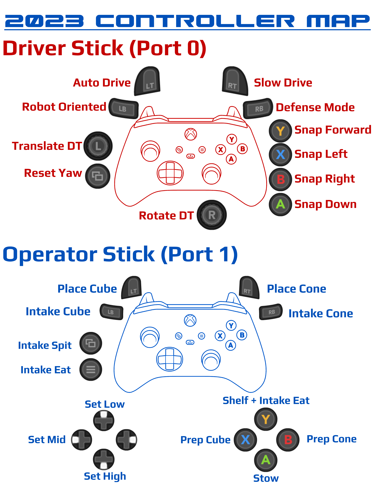

# FRC Team 3255's 2023 Robot

SuperNURDs' code for our 2023 FRC robot Doc Ock. Doc Ock's code is written in Java and uses WPILib's command based framework.

## Controls

## Code Highlights

### Swerve
* Originally based off of Team 364's [BaseFalconSwerve](https://github.com/Team364/BaseFalconSwerve)
* Rewritten to follow our own style and structure
* Uses WPILib swerve classes
* Field Centric Control
  * Uses navX2 gyro
* Autonomous path following using [PathPlanner and PPLib](https://github.com/mjansen4857/pathplanner)
* Auto balance on charge station
  * Uses a very simple two state bang-bang controller to always drive at a slow speed "uphill" and stop when level
  * Uses navX2 gyro
  * Requires specific rotation of robot
  * Only used in autonomous, not teleop
* MK4I's with Falcon 500 Pinions and L2 Gearing purchased from [Swerve Drive Specialties](https://www.swervedrivespecialties.com/products/mk4i-swerve-module)

### Arm
* Uses a state machine to control position
* States are combinations of shoulder and elbow angles
* Transition states may be used to avoid arm collisions
* Each joint position is controlled using [Motion Magic](https://v5.docs.ctr-electronics.com/en/stable/ch16_ClosedLoop.html#motion-magic-position-velocity-current-closed-loop-closed-loop)
  * Cruise velocity is set to very high value and only the acceleration limit value is tuned.
* 2 Falcon 500s - One for the elbow, one for the shoulder
  

### Intake
* Mounted at the end of the arm and used to intake game pieces
* Employs a limit switch to determine when a game piece is collected
* Applies a small, constant current when a game piece is collected to prevent it from falling out
* 2 NEO 550s, placed on the left and right of the intake, each with SparkMax Motor Controllers

### Collector
* Deployed when intaking cubes from the floor to help guide them into our intake
* Falcon 500 - Pivot motor
  * Controls the angle in which the collector is deployed. Only set to a "stow" or a "collecting" angle.
* NEO 550 with a SparkMax Motor Controller - Roller motor
  * Controls the speed of the rollers

  
