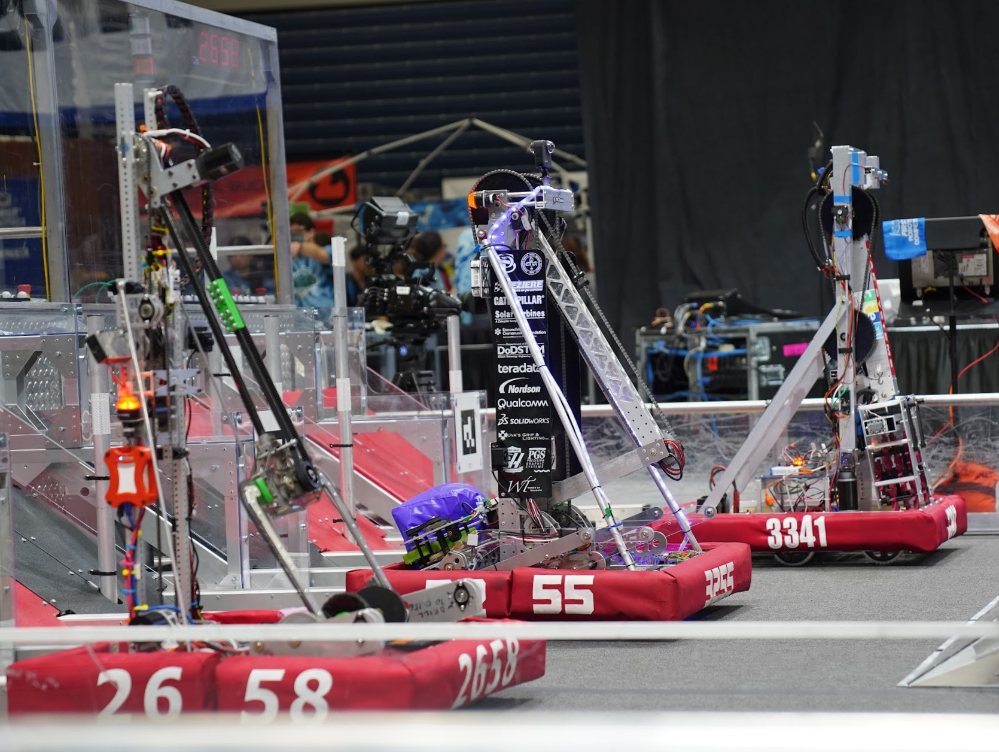
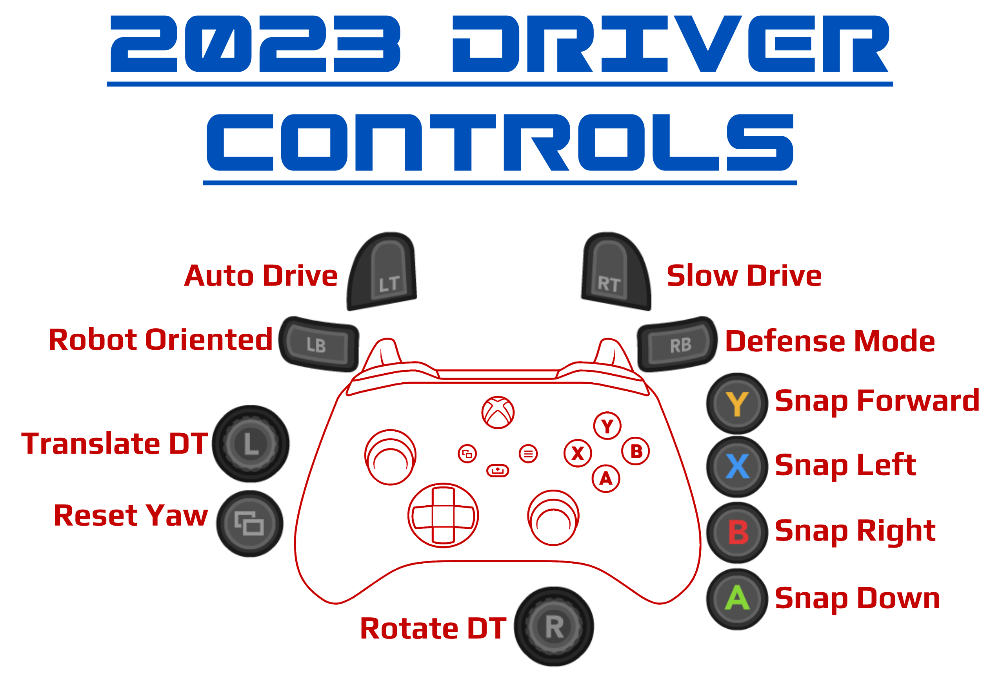
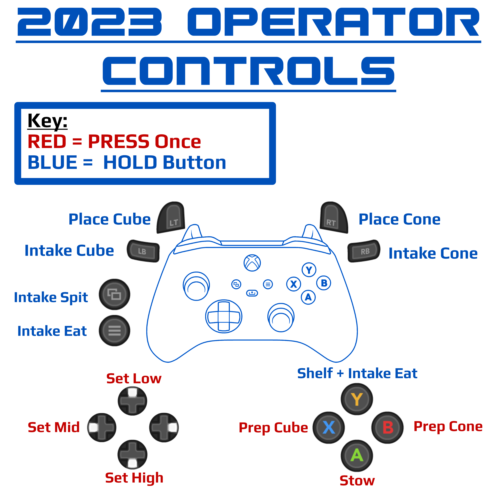

# **Doc Ock** - FRC Team 3255's 2023 Robot

The SuperNURDs' code for our 2023 FRC robot, Doc Ock. Doc Ock's code is written in Java and uses WPILib's command based framework.

## Controls

## Code Highlights

### Swerve
* Originally based off of Team 364's [BaseFalconSwerve](https://github.com/Team364/BaseFalconSwerve)
* Rewritten to follow our own style and structure
* Uses WPILib swerve classes
* Field Centric Control
  * Uses navX2 gyro
* Autonomous path following using [PathPlanner and PPLib](https://github.com/mjansen4857/pathplanner)
* Auto balance on charge station
  * Uses a very simple two state bang-bang controller to always drive at a slow speed "uphill" and stop when level
  * Uses navX2 gyro
  * Requires specific rotation of robot
  * Only used in autonomous, not teleop
* MK4Is with Falcon 500 Pinions and L2 Gearing purchased from [Swerve Drive Specialties](https://www.swervedrivespecialties.com/products/mk4i-swerve-module)

### Arm
* Uses a state machine to control position
* States are combinations of shoulder and elbow angles
* Transition states may be used to avoid arm collisions
* Each joint position is controlled using [Motion Magic](https://v5.docs.ctr-electronics.com/en/stable/ch16_ClosedLoop.html#motion-magic-position-velocity-current-closed-loop-closed-loop)
  * Cruise velocity is set to very high value and only the acceleration limit value is tuned.
* 2 [Falcon 500s](https://www.vexrobotics.com/pro/falcon-500) - One for the elbow, one for the shoulder
  
### Intake
* Mounted at the end of the arm and used to intake game pieces
* Employs a limit switch to determine when a game piece is collected
* Applies a small, constant current when a game piece is collected to prevent it from falling out
* 2 [NEO 550s](https://www.revrobotics.com/rev-21-1651/), placed on the left and right of the intake, each with [SPARK MAX Motor Controllers](https://www.revrobotics.com/rev-11-2158/)

### Collector
* Deployed when intaking cubes from the floor to help guide them into our intake
* [Falcon 500](https://www.vexrobotics.com/pro/falcon-500) - Pivot motor
  * Controls the angle in which the collector is deployed. Only set to a "stow" or a "collecting" angle.
* [NEO 550](https://www.revrobotics.com/rev-21-1651/) with a [SPARK MAX Motor Controller](https://www.revrobotics.com/rev-11-2158/) - Roller motor
  * Controls the speed of the rollers

## Vendor Dependencies and Documentation
*Vendor Dependency - VS Code Online Install Link - Documentation (if applicable)*
* WPILib Command Libraries - Automatically installed with the WPILib Installer
  * [WPILib Documentation](https://docs.wpilib.org/en/stable/index.html)
* SuperCORE - https://SuperNURDs.com/installSuperCORE
  * [SuperCORE JavaDocs](https://frcteam3255.github.io/SuperCORE/releases/com/frcteam3255/supercore/javadoc-latest/)
* Kauai Labs (NavX) - https://dev.studica.com/releases/2023/NavX.json
* PathPlanner - https://3015rangerrobotics.github.io/pathplannerlib/PathplannerLib.json
  * [PathPlanner Wiki](https://github.com/mjansen4857/pathplanner/wiki)
* CTRE Phoenix v5 Framework - https://maven.ctr-electronics.com/release/com/ctre/phoenix/Phoenix5-frc2023-latest.json
  * [Phoenix Documentation](https://v5.docs.ctr-electronics.com/en/stable/)
* PhotonLib (PhotonVision) - https://maven.photonvision.org/repository/internal/org/photonvision/PhotonLib-json/1.0/PhotonLib-json-1.0.json
  * [PhotonVision Documentation](https://docs.photonvision.org/en/latest/)
* REVLib - https://software-metadata.revrobotics.com/REVLib-2023.json
  
